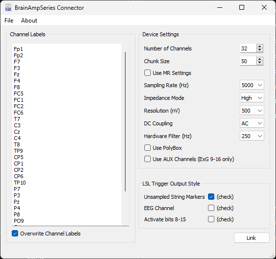

# BrainAmp Series LSL connector
LSL connector for the BrainAmp family of devices from Brain Products.

To download, please click the Release tab above for the latest versions.

Please note that you may need to install the Microsoft C++ redistributable packages ([here](https://support.microsoft.com/en-us/help/2977003/the-latest-supported-visual-c-downloads)) in order to run the executables.

# Getting Started
If you are new to using LSL, you might want to read the [Quick Start guide](https://labstreaminglayer.readthedocs.io/info/getting_started.html) on the LabStreamingLayer main repository. 

For measuring impedances, ensuring good signal quality, and troubleshooting basic amplifier functionality, it is always recommended to use [BrainVision Recorder](https://www.brainproducts.com/downloads.php?kid=2) and to consult the amplifier manual.

You can also find a useful (free) LSL viewer on the Brian Products website: [BrainVision LSL Viewer](https://www.brainproducts.com/downloads.php?kid=40).

# Usage

1. Make sure that you have correctly installed the drivers for your amplifier, and that the amplifier is plugged in, turned on, and batteries are charged (see also official brochure).
  * Start the BrainAmpSeries app. You should see a window like the following.
> 

2. If you have multiple amplifiers plugged in, make sure that you pick the correct one under Device Number (1 is the first one according to USB port numbering). Select the number of channels that you want to record from and enter the channel labels according to your cap design; make sure that the number of channel labels matches the selected number of channels.

3. For most EEG experiments you can ignore the Chunk Size setting, but if you are developing a latency-critical real-time application (e.g., a P300 speller BCI), you can lower this setting to reduce the latency of your system. Also, for most applications it is recommended to leave the Impedance Mode and DC coupling options at their defaults. Further information is found in the amplifier's manual (and/or the BrainVision recorder manual).

4. If you have strong noise sources or you observe clipping of your recorded signal, you can change the resolution setting to a coarser stepping.

5. If you use the PolyBox, check the according box and prepend 8 channel labels at the beginning of the channel list (even if you only use a subset of them). Note that the PolyBox is not the same as the EMG box or other accessories.

6. Click the "Link" button. If all goes well you should now have a stream on your lab network that has name "BrainAmpSeries-0" (if you used device 0) and type "EEG", and a second one named "BrainAmpSeries-0-Markers" with type "Markers" that holds the event markers. Note that you cannot close the app while it is linked.

## Configuration file

The configuration settings can be saved to a .cfg file (see File / Save Configuration) and subsequently loaded from such a file (via File / Load Configuration). Importantly, the program can be started with a command-line argument of the form "BrainAmpSeries.exe -c myconfig.cfg", which allows to load the config automatically at start-up. The recommended procedure to use the app in production experiments is to make a shortcut on the experimenter's desktop which points to a previously saved configuration customized to the study being recorded to minimize the chance of operator error.

